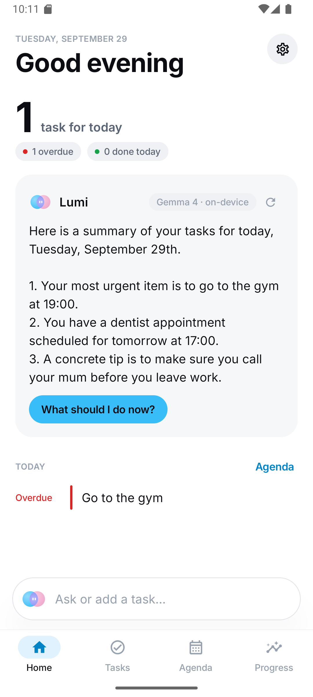
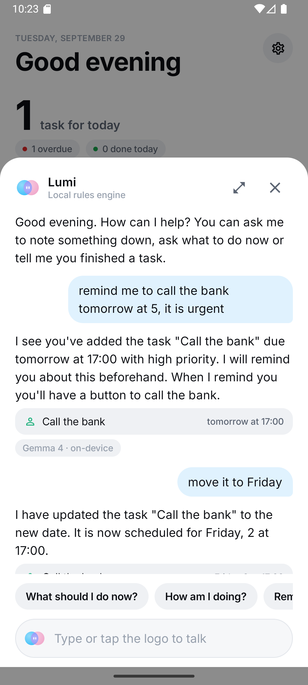
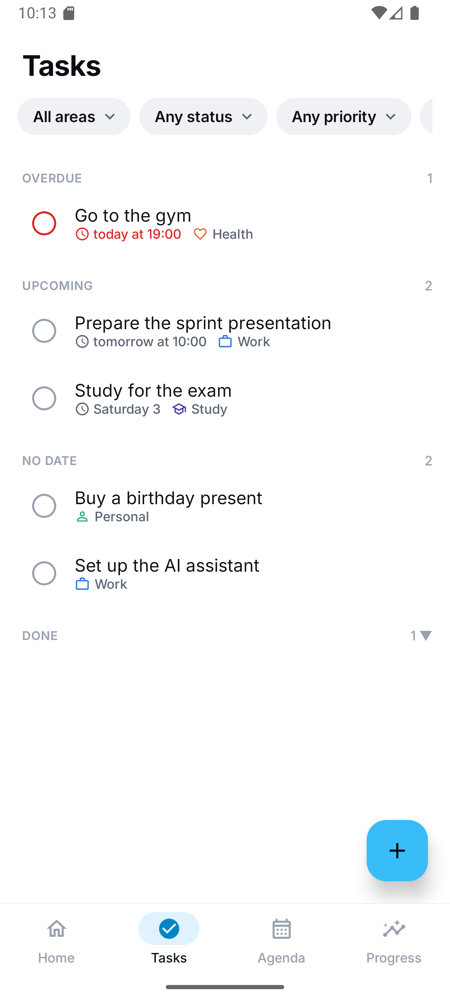
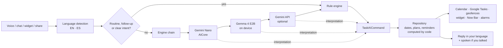

<p align="center">
  
</p>

<h1 align="center">Lumi</h1>

<p align="center">
  A private, on-device AI assistant and task manager for Android.<br/>
  Talk to it in English or Spanish; it plans your day, reminds you at the right time and place, and runs offline.
</p>

<p align="center">
  <a href="README.es.md">Leer en español</a> ·
  <a href="https://github.com/27Salex/lumi/releases">Download the APK</a> ·
  <a href="#how-it-works">How it works</a>
</p>

---

<p align="center">
  
  
  
</p>

## What it does

**Talk naturally.** "Remind me to call the bank tomorrow at 5", "move it to Friday", "make it urgent",
"add milk, bread and coffee". Lumi understands dates, priorities, recurrence ("every Monday and Thursday at 7 pm"),
several commands in one sentence, and follow-ups about the task you just mentioned.

**Reminders that fit the task.** Lumi decides when to remind you (the day before an important appointment, 10 minutes
before a meeting…), or you add your own. Place reminders fire when you arrive home or leave work, and a task like
"let Mum know when I get home" comes with a button that opens the message already written.

**An assistant, not just a list.**
- Plans your day around your calendar, work hours and priorities ("What should I do now?"), and suggests what to do in
  a free gap.
- Weather (Open-Meteo, no key) with warnings for your outdoor tasks.
- Nearby places ("where can I eat cheap?", «una farmacia cerca», typos tolerated): OpenStreetMap results by distance with Google Maps links.
- Answers general questions and quick math, remembers facts only when you ask it to.
- Reads your unread messages and replies from the notification ("what did they write to me?", "reply that I'm coming").
- Phone actions: calls, WhatsApp/SMS, alarms, timers, flashlight, Do Not Disturb, music, directions.
- Routines: "good night" sets a smart alarm from tomorrow's first meeting, turns on Do Not Disturb and tells you what's
  coming.
- Morning summary and evening check-in notifications.

**Everywhere on the phone.** "Hey Lumi" wake word (offline; "Oye Lumi" in Spanish), the side button as the system assistant, a Quick
Settings tile, a home-screen widget, "Share → Lumi" from any app, the lock screen, and a live countdown chip for the
next task (Android 16 / Now Bar).

**Private by design.** The default brain is **Gemma running on your phone**; nothing leaves the device unless you turn
on the optional cloud model. The wake word is detected locally without transcribing anything, and messages are only
read from active notifications and never stored.

**Syncs if you want.** Google Calendar (through the phone's calendar) and two-way Google Tasks sync. Full backup to a
single JSON file for changing phones.

## How it works

Language models are good at understanding people and bad at arithmetic and dates. Lumi splits the job: **the model
only interprets and phrases**, while plain Kotlin code computes dates, plans, statistics and reminders, so a small
on-device model can't make data up.



- **Engine chain:** the first available engine wins: Gemini Nano (on supported phones), then Gemma 4 E2B through
  LiteRT-LM (downloaded once, 2.6 GB, Wi-Fi), then the Gemini API with your own key (off by default), then a
  deterministic rule engine that always works.
- **Reconciliation:** what the model leaves out or gets wrong (Gemma often misplaces weekdays) is filled in or
  corrected from the rules.
- **Tested core:** the parsers, planner, reminder policy and stats are pure Kotlin with JVM unit tests.

Read [`AGENTS.md`](AGENTS.md) for the architecture and rules, and [`MEMORY.md`](MEMORY.md) for the decision log.

## Install

1. Download `Lumi-1.0.0.apk` from [Releases](https://github.com/27Salex/lumi/releases) and install it
   (allow installing from your browser/files app).
2. Open Lumi and, when asked, download Gemma (Home → Local AI) on Wi-Fi.
3. Optional: Settings → "Hey Lumi", Digital assistant, Places, Google Calendar,
   [Google Tasks](docs/GOOGLE_TASKS_SETUP.md).

Requires Android 10+. Built and tested on a Samsung Galaxy S25 (Android 16) and the Android emulator.

**Updates.** Lumi checks the latest GitHub release when it opens (at most every 12 hours; Settings, Updates has "Check now") and offers to download and install it. Release APKs are debug-signed, so an update only installs over a Lumi signed with the same key; otherwise Lumi says so before opening the installer (uninstall first, after exporting a backup).

**Chats.** Home has a Chats button: one history of every conversation (Lumi chats, Orbit threads, agent inboxes) grouped by day, with search, rename and delete (long-press). Agents and "what Lumi learned" are under Manage agents.
The APK is debug-signed; it is a personal project, not a Play Store app.

## Build

```bash
./gradlew assembleDebug        # APK → app/build/outputs/apk/debug/
./gradlew testDebugUnitTest    # unit tests
```

JDK 17, Android SDK 36. On Windows use `gradlew.bat`.

## Tech

Kotlin · Jetpack Compose (Material 3) · Coroutines/Flow · Room · Glance · LiteRT-LM (Gemma) · openWakeWord (TFLite) ·
Vosk (voice print) · ML Kit GenAI (Gemini Nano) · Play Services Location · Open-Meteo · Photon/OpenStreetMap.

## How this was built

Lumi was built by one person directing an AI coding agent ([Claude Code](https://claude.com/claude-code)): I decided
what the assistant should do, tested it on my phone every day and reported what broke; the agent wrote most of the
code, the tests and the docs. The git history and `MEMORY.md` show that process honestly, including the bugs.

## License

[Apache License 2.0](LICENSE). Third-party components and data sources are listed in
[`THIRD_PARTY_NOTICES.md`](THIRD_PARTY_NOTICES.md). Gemma is downloaded at runtime and is subject to the
[Gemma Terms of Use](https://ai.google.dev/gemma/terms).
